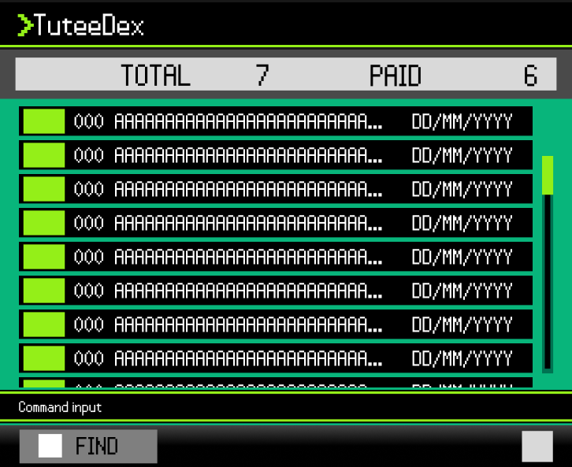

# TuteeDex 🔥

* This is a project done for the module **CS2103T Software Engineering**.
* **TuteeDex** is a desktop app designed specifically for **private tutors** to manage their students.
* It organizes student details, parent contacts, and fee tracking seamlessly — eliminating administrative chaos, preventing missed payments, and saving hours each week so tutors can focus on teaching.
* It is **written in an object-oriented programming (OOP) style** and is built on Java and JavaFX.

## Features
* Add a student's contact, address, and payment info
* View each contact's full profile
* List all contacts
* Edit a contact
* Delete a contact
* Find a contact by name
* Exit the app

## Documentation
* [User Guide](docs/UserGuide.md)
* [Developer Guide](docs/DeveloperGuide.md)

## Acknowledgements
* This project is based on the AddressBook-Level3 project created by the [SE-EDU initiative](https://se-education.org).
